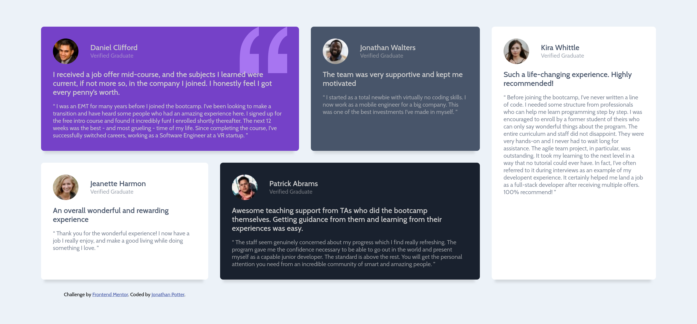

# Frontend Mentor - Testimonials grid section solution

This is a solution to the [Testimonials grid section challenge on Frontend Mentor](https://www.frontendmentor.io/challenges/testimonials-grid-section-Nnw6J7Un7). Frontend Mentor challenges help you improve your coding skills by building realistic projects.

## Table of contents

- [Frontend Mentor - Testimonials grid section solution](#frontend-mentor---testimonials-grid-section-solution)
  - [Table of contents](#table-of-contents)
  - [Overview](#overview)
    - [The challenge](#the-challenge)
    - [Screenshot](#screenshot)
    - [Links](#links)
  - [My process](#my-process)
    - [Built with](#built-with)
    - [What I learned](#what-i-learned)
  - [Author](#author)

**Note: Delete this note and update the table of contents based on what sections you keep.**

## Overview

### The challenge

Users should be able to:

- View the optimal layout for the site depending on their device's screen size

### Screenshot

### Links

- Original challenge: [https://www.frontendmentor.io/challenges/testimonials-grid-section-Nnw6J7Un7/hub](https://www.frontendmentor.io/challenges/testimonials-grid-section-Nnw6J7Un7/hub)

- Live Site URL: [https://jonathandpotter.github.io/testimonials-grid-section-main/]([https://your-live-site-url.com](https://jonathandpotter.github.io/testimonials-grid-section-main/))

## My process

### Built with

- Semantic HTML5 markup
- CSS
- Flexbox
- CSS Grid
- Mobile-first workflow

### What I learned

I used this project to practice responsive grid layouts. I have habitually used flexbox for most layouts and I wanted to specifically do some projects that focused on using grid to get more proficient with it.

## Author

- Website - [Jonathan Potter](https://portfolio-next-snowy-omega.vercel.app/)
- Frontend Mentor - [@@JonathanDPotter](https://www.frontendmentor.io/profile/@JonathanDPotter)
